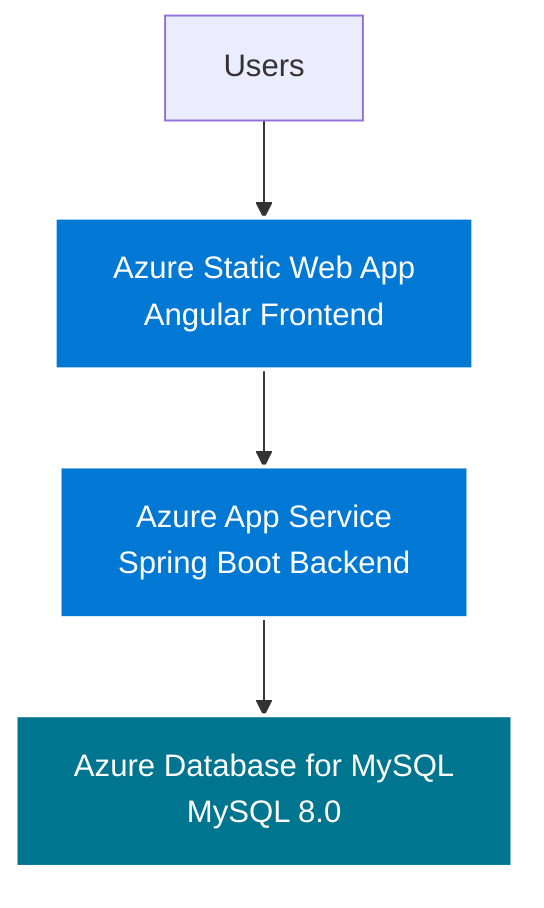

# Azure Deployment Guide - Local Search Platform

This guide will walk you through deploying your Local Search Platform to Azure with:
- **MySQL Database** (Azure Database for MySQL)
- **Spring Boot Backend** (Azure App Service)
- **Angular Frontend** (Azure Static Web Apps)

## Prerequisites

- Azure account with an active subscription
- Azure CLI installed ([Download here](https://docs.microsoft.com/en-us/cli/azure/install-azure-cli))
- Git installed
- Node.js 18+ and npm
- Java 17+ and Maven

## Architecture Overview



---

## Part 1: Deploy MySQL Database

### Step 1.1: Create Azure Database for MySQL

```bash
# Login to Azure
az login

# Set your subscription (if you have multiple)
az account set --subscription "YOUR_SUBSCRIPTION_ID"

# Create a resource group
az group create \
  --name local-search-rg \
  --location eastus

# Create MySQL server (Flexible Server)
az mysql flexible-server create \
  --name local-search-mysql \
  --resource-group local-search-rg \
  --location eastus \
  --admin-user myadmin \
  --admin-password "YourSecurePassword123!" \
  --sku-name Standard_B1ms \
  --tier Burstable \
  --storage-size 32 \
  --version 8.0.21 \
  --public-access 0.0.0.0
```

> [!IMPORTANT]
> Replace `YourSecurePassword123!` with a strong password and save it securely!

### Step 1.2: Configure Firewall Rules

```bash
# Allow Azure services to access the database
az mysql flexible-server firewall-rule create \
  --resource-group local-search-rg \
  --name local-search-mysql \
  --rule-name AllowAzureServices \
  --start-ip-address 0.0.0.0 \
  --end-ip-address 0.0.0.0

# Temporarily allow your local IP for setup (optional)
az mysql flexible-server firewall-rule create \
  --resource-group local-search-rg \
  --name local-search-mysql \
  --rule-name AllowMyIP \
  --start-ip-address YOUR_IP \
  --end-ip-address YOUR_IP
```

### Step 1.3: Create Database

```bash
# Connect to MySQL server
az mysql flexible-server connect \
  --name local-search-mysql \
  --admin-user myadmin \
  --admin-password "YourSecurePassword123!"

# Run in MySQL prompt:
CREATE DATABASE local_search_db;
```

### Step 1.4: Get Connection String

```bash
# Get the connection details
az mysql flexible-server show \
  --resource-group local-search-rg \
  --name local-search-mysql \
  --query "{fqdn:fullyQualifiedDomainName}" \
  --output tsv
```

Save this FQDN (e.g., `local-search-mysql.mysql.database.azure.com`) for later.

---

## Part 2: Deploy Spring Boot Backend

### Step 2.1: Update Application Properties for Production

Create a production properties file:

**File:** `backend/src/main/resources/application-prod.properties`

```properties
# Database Configuration
spring.datasource.url=jdbc:mysql://${MYSQL_HOST}:3306/${MYSQL_DATABASE}?useSSL=true&requireSSL=false&serverTimezone=UTC
spring.datasource.username=${MYSQL_USER}
spring.datasource.password=${MYSQL_PASSWORD}

# JPA Configuration
spring.jpa.hibernate.ddl-auto=update
spring.jpa.show-sql=false
spring.jpa.properties.hibernate.dialect=org.hibernate.dialect.MySQL8Dialect

# JWT Configuration
jwt.secret=${JWT_SECRET}
jwt.expiration=86400000

# Server Configuration
server.port=8080

# CORS Configuration (update with your frontend URL)
cors.allowed.origins=${FRONTEND_URL}

# File Upload
spring.servlet.multipart.max-file-size=10MB
spring.servlet.multipart.max-request-size=10MB
```

### Step 2.2: Update CORS Configuration

Update your `WebConfig.java` or security configuration to read CORS from environment:

**File:** `backend/src/main/java/com/localsearch/config/WebConfig.java`

```java
@Configuration
public class WebConfig implements WebMvcConfigurer {
    
    @Value("${cors.allowed.origins}")
    private String allowedOrigins;

    @Override
    public void addCorsMappings(CorsRegistry registry) {
        registry.addMapping("/**")
                .allowedOrigins(allowedOrigins.split(","))
                .allowedMethods("GET", "POST", "PUT", "DELETE", "OPTIONS")
                .allowedHeaders("*")
                .allowCredentials(true);
    }
}
```

### Step 2.3: Build the Application

```bash
cd backend

# Build JAR file
mvn clean package -DskipTests

# The JAR will be in target/local-search-backend-0.0.1-SNAPSHOT.jar
```

### Step 2.4: Create Azure App Service

```bash
# Create App Service Plan
az appservice plan create \
  --name local-search-plan \
  --resource-group local-search-rg \
  --sku B1 \
  --is-linux

# Create Web App for Java
az webapp create \
  --resource-group local-search-rg \
  --plan local-search-plan \
  --name local-search-backend \
  --runtime "JAVA:17-java17"
```

> [!NOTE]
> The app name `local-search-backend` must be globally unique. If taken, use `local-search-backend-yourname`.

### Step 2.5: Configure Environment Variables

```bash
# Get MySQL FQDN (from Step 1.4)
MYSQL_FQDN="local-search-mysql.mysql.database.azure.com"

# Set application settings
az webapp config appsettings set \
  --resource-group local-search-rg \
  --name local-search-backend \
  --settings \
    MYSQL_HOST="$MYSQL_FQDN" \
    MYSQL_DATABASE="local_search_db" \
    MYSQL_USER="myadmin" \
    MYSQL_PASSWORD="YourSecurePassword123!" \
    JWT_SECRET="your-secure-jwt-secret-key-min-256-bits" \
    FRONTEND_URL="https://your-frontend-url.azurestaticapps.net" \
    SPRING_PROFILES_ACTIVE="prod"
```

> [!CAUTION]
> Replace `JWT_SECRET` with a strong random string (at least 256 bits). You can generate one with:
> ```bash
> openssl rand -base64 32
> ```

### Step 2.6: Deploy Backend

```bash
# Deploy JAR to Azure
az webapp deploy \
  --resource-group local-search-rg \
  --name local-search-backend \
  --src-path target/local-search-backend-0.0.1-SNAPSHOT.jar \
  --type jar
```

### Step 2.7: Verify Backend Deployment

```bash
# Get the backend URL
az webapp show \
  --resource-group local-search-rg \
  --name local-search-backend \
  --query defaultHostName \
  --output tsv

# Test the backend
curl https://local-search-backend.azurewebsites.net/api/businesses
```

---

## Part 3: Deploy Angular Frontend

### Step 3.1: Update Frontend Configuration

Create environment file for production:

**File:** `frontend/src/environments/environment.prod.ts`

```typescript
export const environment = {
  production: true,
  apiUrl: 'https://local-search-backend.azurewebsites.net/api'
};
```

Update `environment.ts` to use this in production builds.

### Step 3.2: Update API Service

Ensure your services use the environment variable:

**File:** `frontend/src/app/services/business.service.ts`

```typescript
import { environment } from '../../environments/environment';

@Injectable({
  providedIn: 'root'
})
export class BusinessService {
  private apiUrl = `${environment.apiUrl}/businesses`;
  // ... rest of the code
}
```

Do the same for `auth.service.ts`, `category.service.ts`, etc.

### Step 3.3: Build Frontend for Production

```bash
cd frontend

# Install dependencies
npm install

# Build for production
npm run build -- --configuration production
```

This creates optimized files in `dist/frontend/browser/`.

### Step 3.4: Deploy to Azure Static Web Apps

#### Option A: Using Azure CLI

```bash
# Install Static Web Apps CLI
npm install -g @azure/static-web-apps-cli

# Create Static Web App
az staticwebapp create \
  --name local-search-frontend \
  --resource-group local-search-rg \
  --location eastus2

# Get deployment token
DEPLOYMENT_TOKEN=$(az staticwebapp secrets list \
  --name local-search-frontend \
  --resource-group local-search-rg \
  --query "properties.apiKey" \
  --output tsv)

# Deploy
cd dist/frontend/browser
az staticwebapp deploy \
  --app-name local-search-frontend \
  --resource-group local-search-rg \
  --deployment-token $DEPLOYMENT_TOKEN
```

#### Option B: Using GitHub Actions (Recommended)

1. Push your code to GitHub
2. Go to [Azure Portal](https://portal.azure.com)
3. Create a Static Web App resource
4. Connect to your GitHub repository
5. Configure build settings:
   - **App location:** `/frontend`
   - **Output location:** `dist/frontend/browser`
   - **API location:** (leave empty)

Azure will automatically set up GitHub Actions for CI/CD!

### Step 3.5: Get Frontend URL

```bash
az staticwebapp show \
  --name local-search-frontend \
  --resource-group local-search-rg \
  --query "defaultHostname" \
  --output tsv
```

### Step 3.6: Update Backend CORS

Now update the backend's `FRONTEND_URL` with your actual frontend URL:

```bash
az webapp config appsettings set \
  --resource-group local-search-rg \
  --name local-search-backend \
  --settings FRONTEND_URL="https://local-search-frontend.azurestaticapps.net"

# Restart the backend
az webapp restart \
  --resource-group local-search-rg \
  --name local-search-backend
```

---

## Part 4: Post-Deployment Configuration

### Step 4.1: Initialize Database

You can use the MySQL client to run your initial SQL scripts:

```bash
# Connect to Azure MySQL
mysql -h local-search-mysql.mysql.database.azure.com \
  -u myadmin \
  -p \
  local_search_db < path/to/your/init.sql
```

Or let Spring Boot's `ddl-auto=update` handle table creation.

### Step 4.2: Set Up Monitoring

```bash
# Enable Application Insights for backend
az monitor app-insights component create \
  --app local-search-insights \
  --location eastus \
  --resource-group local-search-rg

# Link to App Service
az webapp config appsettings set \
  --resource-group local-search-rg \
  --name local-search-backend \
  --settings APPINSIGHTS_INSTRUMENTATION_KEY="YOUR_INSTRUMENTATION_KEY"
```

### Step 4.3: Configure Custom Domain (Optional)

```bash
# For backend
az webapp config hostname add \
  --webapp-name local-search-backend \
  --resource-group local-search-rg \
  --hostname api.yourdomain.com

# For frontend
az staticwebapp hostname set \
  --name local-search-frontend \
  --resource-group local-search-rg \
  --hostname www.yourdomain.com
```

---

## Part 5: Verification & Testing

### Verification Checklist

- [ ] MySQL database is accessible from Azure App Service
- [ ] Backend health check: `https://local-search-backend.azurewebsites.net/actuator/health`
- [ ] Backend API responds: `https://local-search-backend.azurewebsites.net/api/businesses`
- [ ] Frontend loads: `https://local-search-frontend.azurestaticapps.net`
- [ ] Login/Register works from frontend
- [ ] Search functionality works end-to-end
- [ ] CORS is properly configured

### Test Your Deployment

1. **Open Frontend URL** in browser
2. **Create an account** using Register
3. **Login** with your credentials
4. **Search** for businesses
5. **Check browser console** for any errors

---

## Cost Estimates (Monthly)

| Service | Tier | Estimated Cost |
|---------|------|----------------|
| Azure Database for MySQL | Burstable B1ms | ~$15 |
| App Service | Basic B1 | ~$13 |
| Static Web Apps | Free | $0 |
| **Total** | | **~$28/month** |

> [!TIP]
> You can reduce costs by using Azure Free Tier credits or stopping services when not in use.

---

## Troubleshooting

### Issue: Backend can't connect to MySQL

**Solution:** Check firewall rules and connection string
```bash
az mysql flexible-server firewall-rule list \
  --resource-group local-search-rg \
  --name local-search-mysql
```

### Issue: CORS errors in browser

**Solution:** Verify CORS settings
```bash
# Check current FRONTEND_URL setting
az webapp config appsettings list \
  --resource-group local-search-rg \
  --name local-search-backend \
  --query "[?name=='FRONTEND_URL']"
```

### Issue: Backend logs showing errors

**Solution:** View logs
```bash
az webapp log tail \
  --resource-group local-search-rg \
  --name local-search-backend
```

---

## Cleanup (Delete All Resources)

```bash
# Delete the entire resource group
az group delete \
  --name local-search-rg \
  --yes \
  --no-wait
```

---

## Next Steps

- [ ] Set up SSL certificates for custom domains
- [ ] Configure Azure AD authentication
- [ ] Set up automated backups for MySQL
- [ ] Implement Azure CDN for frontend
- [ ] Configure scaling rules
- [ ] Set up monitoring alerts

## Additional Resources

- [Azure App Service Documentation](https://docs.microsoft.com/en-us/azure/app-service/)
- [Azure Static Web Apps Documentation](https://docs.microsoft.com/en-us/azure/static-web-apps/)
- [Azure Database for MySQL Documentation](https://docs.microsoft.com/en-us/azure/mysql/)

---

**🎉 Congratulations!** Your Local Search Platform is now deployed on Azure!
